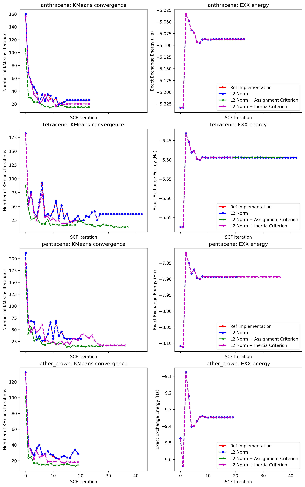

# Improvements to the Weighted Kmeans Convergence Criteria

## 1.1 Implementation of the L2 norm

#### Motivation

Lloyd’s K-means minimises sum of squared Euclidean distances. Using $L_2$ to stop is the consistent choice: If centroids
barely move under $L_2$, the loss is barely changing. Additionally, the $L_2$ norm is rotationally invariant. The same 
system under rotation might give different convergence behaviour under the component-wise rule but should give consistent 
behaviour when using $L_2$.

#### Convergence Behaviour, and Effect on Exchange Energy

The change in criterion gives almost identical convergence behaviour in kmeans (smae number of iterations per algorithm step)
and has no effect on the reference exchange energy. The algorithm also fractionally sped up. I'm not sure why this would
be the case, it implies that the implementation is fractionally faster.

As such, this change is worth implementing.


## 1.2 Implementation of Grid Assigment Stability as an Additional Termination Threshold

As stated in the paper of Dong, Hu and Lin [1](J. Chem. Theory Comput. 2018, 14, 1311−1320):

"We find that the K-Means algorithm spends around half the number of iterations to wait for 0.1% of the points to settle 
on the respective clusters. However, these points often belong to the boundary of the clusters and have little effect on
the positions of the centroids (interpolation points). Therefore, we decide to terminate the K-Means algorithm whenever
the fraction of points that switch clusters falls below the 0.1% threshold."

There is no theoretical rationalisation for this, it's just an empirical observation. I have implemented like:

```fortran
      ! J. Chem. Theory Comput. 2018, 14, 1311−1320
      ! Dong, Hu and Lin lin empirical criterion for terminating kmeans when one is left
      ! with boundary points that are just oscillating between centroids
      if ((real(change_cnt, real64) / real(mesh%np, real64)) < 0.001_real64) then
        point_assignment_stable = point_assignment_stable + 1
      else 
        point_assignment_stable = 0
      endif

      if (.not. any(points_differ)) then
        converged = .true.
        write(message(1), '(a)') 'Debug: All centroid points converged'
        call messages_info(1, debug_only=.true.)
        write(message(1), '(a, I4, a)') 'Kmeans converged in ', i , ' iterations'
        call messages_info(1)
        exit
      ! Have 99.9% of point assignments stable for 2 iterations before terminating, 
      ! which is slightly safer than what Dong et. al. do 
      elseif(point_assignment_stable == 2) then
        converged = .true.
        write(message(1), '(a)') 'Debug: 99.9% of grid points have not been reassigned for 2 iterations'
        call messages_info(1, debug_only=.true.)
        write(message(1), '(a, I4, a)') 'Kmeans converged in ', i , ' iterations'
        call messages_info(1)
        exit
      else
        prior_centroids = centroids
      endif
```
such that this criterion must be true for 2 iterations before one terminates.

#### Convergence Behaviour, and Effect on Exchange Energy

This criterion has an effect of substantially reducing the number of kmeans iterations for all SCF steps, including the first, and effectively
speeds up the kmeans algorithm modestly for anthracene, pentacene abd the ether crown, and substantially for tetracene. For tetracene, one therefore
assumes that there were several grid points that switched assignments, slowing down convergence.
However, for pentacene one actually requires more SCF iterations as a consequence. I do not understand what is going on here.
I need to do additional analysis on the plot that focuses on this.

In all test cases, this criterion speeds up the total execution time of the algorith. And because it also speeds up 
the first SCF iteration, could be beneficial for GS as well as TD modes. However, the change the EXX by 
$\sim 1 \times 10^{-6}$, which is an error larger than I'm happy with (for now).


## 1.3 Implementation of Inertia as an Additional Termination Threshold

GPT suggested to use the inertia definition, which I was already using for testing purposes as a measure of 
final centroid quality. Consistent with the grid assignment criterion, the inertia must be unchanged for two iterations
before existing occurs. This choice is arbitrary. Unlike the grid assigment criterion, which I can compute on the fly, for the inertia I 
must iterate over all grid points an additional time, per kmeans iteration.

```fortran
      ! Use inertia as an additional stability metric, for algorithm termination
      call compute_centroid_inertia(mesh, centroids, weight, ip_to_ic, inertia_)
      inertia_thres = rtol_i * max(1.0_real64, max(prior_inertia, inertia_))
      if (abs(prior_inertia - inertia_) < inertia_thres) then
        stable = stable + 1
      else
        stable = 0
      endif

      call update_centroids(mesh, weight, ip_to_ic, centroids)

      ! L2 threshold
      call compute_grid_difference(prior_centroids, centroids, atol, rtol, points_differ)

      ! Check convergence and exist
      if (.not. any(points_differ)) then
        converged = .true.
        write(message(1), '(a)') 'Debug: All centroid points converged'
        call messages_info(1, debug_only=.true.)
        write(message(1), '(a, I4, a)') 'Kmeans converged in ', i , ' iterations'
        call messages_info(1)
        exit
      elseif (stable >= stable_thres) then
        converged = .true.
        write(message(1), '(a)') 'Debug: Inertia stable'
        call messages_info(1, debug_only=.true.)
        write(message(1), '(a, I4, a)') 'Kmeans converged in ', i , ' iterations'
        call messages_info(1)
        exit
      else
        prior_inertia = inertia_
        prior_centroids = centroids
      endif
```

#### Convergence Behaviour, and Effect on Exchange Energy

This has the same behaviour as the grid assignment criterion, except it's a bit slower but generally more
precise.

This criterion also has the effect of reducing the number of kmeans iterations for all SCF steps, **except the first**, and effectively
speeds up the kmeans algorithm modestly for anthracene, pentacene abd the ether crown, and substantially for tetracene. 
However, for pentacene one also requires more SCF iterations as a consequence. More than using the grid assignment criterion, and
so much so that the time spent in kmeans is actually longer than the reference due to the many more SCF iterations required.
I do not understand what is going on here. I need to do additional analysis on the plot that focuses on this. 

In general, this criterion change the EXX by $\sim 1 \times 10^{-6}$ - $\sim 1 \times 10^{-7}$, and always smaller 
than the grid assignment criterion. I find this error acceptable


# 2. Results and Analysis

In general, the grid assignment criterion speeds up all SCF iterations by reducing the number of kmeans calls in all instances, at
the expense of precision. Inertia cost less precision for a more modest speed-up, BUT cost substantially more time in
pentacene (~ 33%). 

In both cases, I think they require testing in the context of TD.

## Figures

Figure 1 shows the effect of the criteria on the number of kmeans iterations required per SCF step, and their effect
on the exact exchange energy (EXX). In all cases, one can see that the change in EXX per SCF iteration are extremely 
small, and so I've looked at the different w.r.t. the reference (current) implementation in figures 2-5.

The introduction of the L2 norm has a negligible effect on the number of kmeans iterations

{ width=75% }

### Effect on EXX as a Function of SCF Iteration

{ width=75% }
{ width=75% }
{ width=75% }
{ width=75% }

### Timings

{ width=75% }
